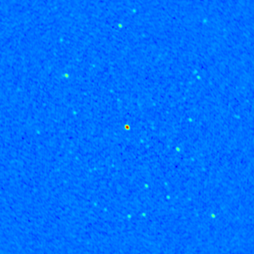

# PoC Test by KRSRC

## References

<https://confluence.skatelescope.org/pages/viewpage.action?pageId=235981012>  
<https://confluence.skatelescope.org/pages/resumedraft.action?draftId=252390056&draftShareId=2069b0b5-62e8-42e0-bd59-65c4778a3722&>  
<https://doc.grid.surfsara.nl/en/latest/Pages/Advanced/softdrive_on_laptop.html#configuring-cvmfs>  
<https://artifacthub.io/packages/helm/sciencebox/cvmfs>  

## Environment

- PoC2 test was performed on an `Ubuntu 22.04` pod (container) in the K3s cluster of the KRSRC testbed.
- In this test, CVMFS was not deployed directly as a container in the Rancher-K3s cluster. Instead, it was deployed under a user Ubuntu container.
  - This may not be an efficient approach from the perspective of managing the entire K3s cluster.
  - Ideally, CVMFS should be set up in the K3s cluster as a storage class or persistent volume, allowing each user's Ubuntu to access it without additional installations.
  - However, this aspect was not addressed in this test.

## Ubuntu 22 deployment on K3s cluster

Making YAML for `ubuntu` deployment: `pod_default_ubuntu-poc.yaml`.

```yaml
apiVersion: v1
kind: Pod
metadata:
  name: ubuntu-poc
  labels:
    app: ubuntu-poc
spec:
  containers:
  - name: ubuntu
    image: ubuntu:latest
    command: ["/bin/sleep", "3650d"]
    securityContext:
      privileged: true
      capabilities:
        add: ["SYS_ADMIN"]
    imagePullPolicy: IfNotPresent
  restartPolicy: Always
```

Deploy the ubuntu pod.

```bash
kubectl apply -f pod_default_ubuntu-poc.yaml
```

Open terminal of `ubuntu-poc` pod.

```bash
kubectl exec --stdin --tty ubuntu-poc -- /bin/bash
```

Set root passwd.

```bash
passwd
```

Install basic libraries.

```bash
apt update
apt install net-tools sudo vim openssh-server
```

Add user for ssh connection.

```bash
adduser {username}
usermod -aG sudo {username}
groups {username}
```

Modify ssh port.

```bash
vi /etc/ssh/sshd_config

Port {sshd_port}

service ssh restart
```

Create LoadBalancer service.

```yaml
apiVersion: v1
kind: Service
metadata:
  name: ubuntu-ssh
spec:
  type: LoadBalancer
  externalIPs:
  - {master_ip}
  ports:
  - name: ubuntu-poc
    port: {sshd_external_port}
    protocal: TCP
    targetPort: {sshd_port}
  selector:
    app: ubuntu-poc
status:
  loadBalancer:
    ingress:
    - ip: {master_ip}
```

Test to connection (from external client).

```bash
ssh -X -p {sshd_external_port} manager@{master_ip}
```

## Installation on Ubuntu container

### FUSE installation

Start with root account.

```bash
sudo bash -
```

Download and compile `FUSE`.

```bash
apt install meson pkg-config python3-pip udev
wget https://github.com/libfuse/libfuse/releases/download/fuse-3.10.5/fuse-3.10.5.tar.xz
tar xfJ fuse-3.10.5.tar.xz
cd fuse-3.10.5/
mkdir build
cd build
meson ..
meson configure
meson configure -D disable-mtab=true
ninja
ninja install
```

Creat sym link.

```bash
ln -s /usr/local/lib/x86_64-linux-gnu/libfuse3.so.3 /usr/lib/x86_64-linux-gnu/libfuse3.so.3

ln: failed to create symbolic link '/usr/lib/x86_64-linux-gnu/libfuse3.so.3': File exists
```

Delete and create link again.

```bash
rm /usr/lib/x86_64-linux-gnu/libfuse3.so.3
ln -s /usr/local/lib/x86_64-linux-gnu/libfuse3.so.3 /usr/lib/x86_64-linux-gnu/libfuse3.so.3
```

Configure `FUSE` (uncomment).

```bash
vi /etc/fuse.conf

user_allow_others
```

Install `squid` and check http proxy port.

```bash
apt install squid
cat /etc/squid/squid.conf | grep http_port
service squid start
```

### Apptainer installation

```bash
apt update
apt install software-properties-common
add-apt-repository ppa:apptainer/ppa
apt update
apt install apptainer
apt install apptainer-suid
```

### CVMFS installation

Add the CVMFS repository and install CFMFS.

```bash
wget https://ecsft.cern.ch/dist/cvmfs/cvmfs-release/cvmfs-release-latest_all.deb
dpkg -i cvmfs-release-latest_all.deb
rm -f cvmfs-release-latest_all.deb
apt update
apt install cvmfs
```

<!-- ```bash
cat /etc/auto.master.d/cvmfs.autofs
service austofs restart
``` -->

Create the configuration file.

```bash
vi /etc/cvmfs/default.local

CVMFS_NFILES=32768
CVMFS_REPOSITORIES=softdrive.nl
CVMFS_QUOTA_LIMIT=2000
CVMFS_HTTP_PROXY="http://localhost:{squid_http_port}"

vi /etc/cvmfs/config.d/softdrive.nl.conf

CVMFS_SERVER_URL=http://cvmfs01.nikhef.nl/cvmfs/@fqrn@
CVMFS_PUBLIC_KEY=/etc/cvmfs/keys/softdrive.nl.pub

vi /etc/cvmfs/keys/softdrive.nl.pub

-----BEGIN PUBLIC KEY-----
MIIBIjANBgkqhkiG9w0BAQEFAAOCAQ8AMIIBCgKCAQEA481/kCXbrVtLuzcFZ2uO
EmiAKx28qXIkonPwr/gSmqQ8k1zQA7dKK5YZwZSbVwgYqvhvW6i3vKWLGVDj+elH
1u8uumPzzlAJHrS1XoR8rY4xUULjQBvV9HuJxE6OK4ZEZPvQmeGmjXd446c8J5cv
BQFtaonRnrxAbtO+Z0KtzsNOzBNFegu9z+lT7/fxV17Qh10w5IKQjm/v6jPdj1ME
CrG4QW2S9+Y+7YzbRP5QYaE4cl5cBI3Yb048ufgLJMfX3++uqwGM+rqNs/CzHvsW
dO6Jznr9EbzqbIrTsFeUThNmsGPObxOT3VmB0BTTjrZSYjgf8oEE4hdhgNQgh7vs
OwIDAQAB
-----END PUBLIC KEY-----
```

Stop and start (not restart) `autofs`, and check cvmfs_config.

```bash
cvmfs_config setup
service autofs stop
service autofs start
cvmfs_config chksetup

OK
```

<!-- 
So I ran `cvmfs_config setup` first, and as a result, the `cvmfs.autofs` file was created in `/etc/auto.master.d/`.

```bash
cvmfs_config setup
cat /etc/auto.master.d/cvmfs.autofs

# automatically generated by CernVM-FS
/cvmfs /etc/auto.cvmfs
```

After restarting the `autofs` service once, when I ran `cvmfs_config chksetup`, `OK` was output succesfully.

```bash
systemctl restart autofs
cvmfs_config chksetup

OK
```

I set up the mount point. When I tried to create the `/var/lib/cvmfs` directory, it already existed.

```bash
mkdir -p /cvmfs/softdrive.nl
mkdir /var/lib/cvmfs

mkdir: cannot create directory '/var/lib/cvmfs': File exists
```

I tried to mount `softdrive.nl` and it was already mounted.  
It seems to have been mounted automatically in the previous step.

```bash
mount -t cvmfs softdrive.nl /cvmfs/softdrive.nl

Repository softdrive.nl is already mounted on /cvmfs/softdrive.nl
``` -->

Check `/cvmfs/softdrive.nl` by `ls`.

```bash
ls /cvmfs/softdrive.nl/
```

<!-- Unmount `softdrive.nl`.  
However, even after `umount`, the files still remain in `/cvmfs/softdrive.nl`.

```bash
umount /cvmfs/softdrive.nl
ls /cvmfs/softdrive.nl
``` -->

### Configuration EESSI share on CVMFS

Configure EESSI share.

```bash
wget https://github.com/EESSI/filesystem-layer/releases/download/latest/cvmfs-config-eessi_latest_all.deb
dpkg -i cvmfs-config-eessi_latest_all.deb
service autofs stop
service autofs start
ls /cvmfs/pilot.eessi-hpc.org/
```

<!-- Create client configuration file for CernVM-FS (no squid proxy, 10GB local CernVM-FS client cache).  
Make sure that EESSI CernVM-FS repository is accessible.

> [!WARNING]
> This command will overwrite any existing cvmfs configuration. 
> I'm not sure if overwriting is correct.

```bash
bash -c "echo 'CVMFS_CLIENT_PROFILE="single"' > /etc/cvmfs/default.local"
bash -c "echo 'CVMFS_QUOTA_LIMIT=10000' >> /etc/cvmfs/default.local"
cvmfs_config setup
```

> [!IMPORTANT]
> I ran the above command to overwrite the existing cvmfs configuration.  
> It resulted in the removal of the mounted `softdrive.nl` repository in `/cvmfs`.  -->

### Installation Singularity

```bash
wget https://github.com/sylabs/singularity/releases/download/v4.0.0/singularity-ce_4.0.0-focal_amd64.deb
apt install ./singularity-ce_4.0.0-focal_amd64.deb
```

## Test PoC 2

From here, test with a regular user account, not root.

- Check if the EESSI CVMFS share is mounted and has the DP3 and WSClean binaries:

```bash
ls /cvmfs/pilot.eessi-hpc.org/versions/2023.06/software/linux/x86_64/amd/zen2/software/DP3/6.0-foss-2022a/bin/

DP3  DPPP  makesourcedb  msoverview  showsourcedb
```

```bash
ls /cvmfs/pilot.eessi-hpc.org/versions/2023.06/software/linux/x86_64/amd/zen2/software/WSClean/3.4-foss-2022a/bin/

chgcentre  wsclean  wsclean-mp
```

```bash
ls -lah /cvmfs/softdrive.nl/oonk/SINGULARITY_IMAGES/C7_2_20_2_sml_env/

total 853M
drwxr-xr-x 2 cvmfs cvmfs 4.0K Nov 23  2017 .
drwxr-xr-x 4 cvmfs cvmfs 4.0K Apr  1  2020 ..
-rwxr-xr-x 1 cvmfs cvmfs 853M Nov 23  2017 lofar-2_20_2_c7_sml_env.simg
```

```bash
ls -lah /cvmfs/softdrive.nl/surfadvisors-tkok/POC2/

total 25K
drwxr-xr-x  3 cvmfs cvmfs 4.0K Nov  7 16:19 .
drwxr-xr-x  6 cvmfs cvmfs 4.0K Dec 13 13:18 ..
-rwxr-xr-x  1 cvmfs cvmfs  859 Nov  7 16:19 3C196PANDEYJUL14.model
drwxrwxr-x 21 cvmfs cvmfs 4.0K Nov  7 16:19 L229585_SB000_uv.dppp.MS
-rwxr-xr-x  1 cvmfs cvmfs 1.2K Nov  7 16:19 command.sh
-rwxr-xr-x  1 cvmfs cvmfs 2.0K Nov  7 16:19 fits_to_png.py
-rw-r--r--  1 cvmfs cvmfs 6.8K Nov  7 16:19 process.py
```

```bash
mkdir ~/test_poc2
cp -r /cvmfs/softdrive.nl/surfadvisors-tkok/POC2/* ~/test_poc2/
cd ~/test_poc2
```

```bash
./command.sh

START:
ubuntu-poc

Initilizing EESSI
Found EESSI pilot repo @ /cvmfs/pilot.eessi-hpc.org/versions/2023.06!
archspec says x86_64/intel/haswell
Using x86_64/intel/haswell as software subdirectory.
Using /cvmfs/pilot.eessi-hpc.org/versions/2023.06/software/linux/x86_64/intel/haswell/modules/all as the directory to be added to MODULEPATH.
Found Lmod configuration file at /cvmfs/pilot.eessi-hpc.org/versions/2023.06/software/linux/x86_64/intel/haswell/.lmod/lmodrc.lua
Initializing Lmod...
Prepending /cvmfs/pilot.eessi-hpc.org/versions/2023.06/software/linux/x86_64/intel/haswell/modules/all to $MODULEPATH...
Environment set up to use EESSI pilot software stack, have fun!
Loading DP3 and WSClean
Running calibration and imaging script
Creating PNG image
binding to: , /home,

singularity exec ls: ,
FATAL:   container creation failed: mount /etc/localtime->/etc/localtime error: while mounting /etc/localtime: mount source /etc/localtime doesn't exist

singularity exec python process data script: , /home/manager/test_poc2/fits_to_png.py

done
```

To resolve `/etc/localtime` error,

> [!IMPORTANT]
> <https://epcced.github.io/2021-07-29_Singularity_Online/07-singularity-images-building/index.html>

```bash
sudo apt install tzdata
```

Re-run from `Creating PNG image`:

```bash
Creating PNG image
binding to: , /home

singularity exec ls: ,
Using /opt/lofar/ as root for the LOFAR Software Stack (created by JBR OONK UL/ASTRON Nov2017)
3C196PANDEYJUL14.model
L229585_SB000_uv.dppp.MS
L229585_SB000_uv.dppp.MS.ccfa
L229585_SB000_uv.dppp.MS.ccfa.app.parset
L229585_SB000_uv.dppp.MS.ccfa.avg.log
L229585_SB000_uv.dppp.MS.ccfa.avg.parset
L229585_SB000_uv.dppp.MS.ccfa.cicc
L229585_SB000_uv.dppp.MS.ccfa.cicc.cimg-dirty.fits
L229585_SB000_uv.dppp.MS.ccfa.cicc.cimg-image.fits
L229585_SB000_uv.dppp.MS.ccfa.cicc.cimg-model.fits
L229585_SB000_uv.dppp.MS.ccfa.cicc.cimg-psf.fits
L229585_SB000_uv.dppp.MS.ccfa.cicc.cimg-residual.fits
L229585_SB000_uv.dppp.MS.ccfa.cicc.parset
L229585_SB000_uv.dppp.MS.ccfa.ndp_app.log
L229585_SB000_uv.dppp.MS.ccfa.ndp_pre.log
L229585_SB000_uv.dppp.MS.ccfa.pre.parset
L229585_SB000_uv.dppp.MS.inst
cdmx.log
command.sh
fits_to_png.py
fpng.log
process.py

singularity exec python process data script: , /home/manager/test_poc2/fits_to_png.py

done
```



PoC2 test is DONE!!!
